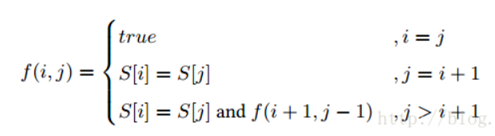

# 算法技巧笔记

## 字符串

1. 子字符串问题 - **滑动窗**
2. 回文串问题 - **动态规划**
3. 判断是否是回文串的公式
   
    

4. 的

## 数组

1. k sum 类问题，先确定 k-2 个数，在确定的过程中要记得去重，之后，转化为 2 sum 问题，即在一个列表中进行双指针搜索，并判断左右指针的和是否为 target 的问题，同时要先进行去重操作，之后再进行下一次寻找
2. 

## 排序

## 链表

## 栈

## 队列

## 动态规划

## 树

## 数学与智商
