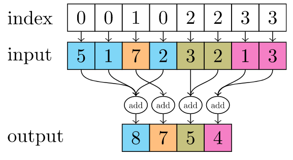

# torch scatter 相关操作

1. 稀疏矩阵相关操作

```python
>>> x = torch.rand(2, 5)
>>> x
tensor([[ 0.3992,  0.2908,  0.9044,  0.4850,  0.6004],
        [ 0.5735,  0.9006,  0.6797,  0.4152,  0.1732]])
>>> torch.zeros(3, 5).scatter_(0, torch.tensor([[0, 1, 2, 0, 0], [2, 0, 0, 1, 2]]), x)
tensor([[ 0.3992,  0.9006,  0.6797,  0.4850,  0.6004],
        [ 0.0000,  0.2908,  0.0000,  0.4152,  0.0000],
        [ 0.5735,  0.0000,  0.9044,  0.0000,  0.1732]])

>>> z = torch.zeros(2, 4).scatter_(1, torch.tensor([[2], [3]]), 1.23)
>>> z
tensor([[ 0.0000,  0.0000,  1.2300,  0.0000],
        [ 0.0000,  0.0000,  0.0000,  1.2300]])
```

* `scatter_(dim, index, src) → Tensor` 这里 index 表示 src 的输出按照 dim 的索引
* index 和 src 的维度必须一样，index 表示 **输出索引**，即如果 dim = 0，则src按行存放，index中的数字为行索引
* 要按照顺序存放，即当dim=0时， index 表示行号，按列进行遍历 src
* `rows = index, cols = [[0, 1, 2, 3, 4], [0, 1, 2, 3, 4]]`

```python
>>> t = torch.tensor([[1,2],[3,4]])
>>> torch.gather(t, 1, torch.tensor([[0,0],[1,0]]))
tensor([[ 1,  1],
        [ 4,  3]])
```

* `torch.gather(input, dim, index, out=None, sparse_grad=False) → Tensor`
* out 和 index 有相同的维度
* 上述表示按列收集 t , index 对应的是 t 中的列索引

```python
>>> x = torch.rand(2, 5)
>>> x
tensor([[0.7404, 0.0427, 0.6480, 0.3806, 0.8328],
        [0.7953, 0.2009, 0.9154, 0.6782, 0.9620]])
>>> torch.ones(3, 5).scatter_add_(0, torch.tensor([[0, 1, 2, 0, 0], [2, 0, 0, 1, 2]]), x)
tensor([[1.7404, 1.2009, 1.9154, 1.3806, 1.8328],
        [1.0000, 1.0427, 1.0000, 1.6782, 1.0000],
        [1.7953, 1.0000, 1.6480, 1.0000, 1.9620]])
```

* 分散加法
* 上述表示按行加法

```python
tensor([[1.7404(0), 1.2009(0), 1.9154(0), 1.3806(0), 1.8328(0)],
        [1.0000(), 1.0427(1), 1.0000(), 1.6782(1), 1.0000()],
        [1.7953(2), 1.0000(), 1.6480(2), 1.0000(), 1.9620(2)]])
```

